# 🎓 Dashboard Sekolah

Aplikasi ini merupakan sistem manajemen data sekolah berbasis web. Menggunakan **PHP + MySQL** dan template **AdminLTE** untuk tampilan dashboard. Aplikasi mendukung berbagai role pengguna: **Admin**, **Guru**, dan **Siswa**.

---

## 🏠 Dashboard Utama

Menampilkan tampilan utama sesuai dengan role login.

### 📘 Dashboard Siswa
Menampilkan informasi siswa, jurusan dan agama dengan statistik, namun hanya dapat melihat(read-only) informasi detail data siswa.

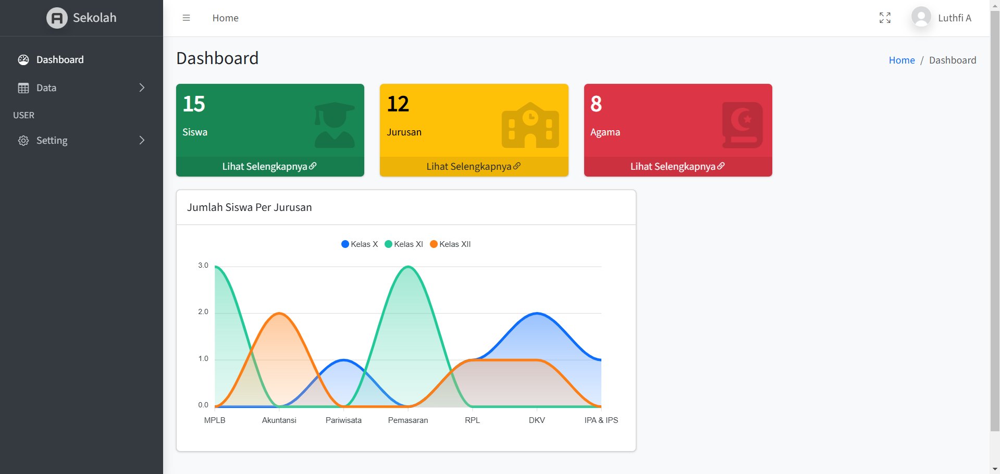

### 🧑‍🏫 Dashboard Guru
Menampilkan informasi siswa, jurusan, dan agama dengan statistik, dapat melihat semua data namun hanya read-only.

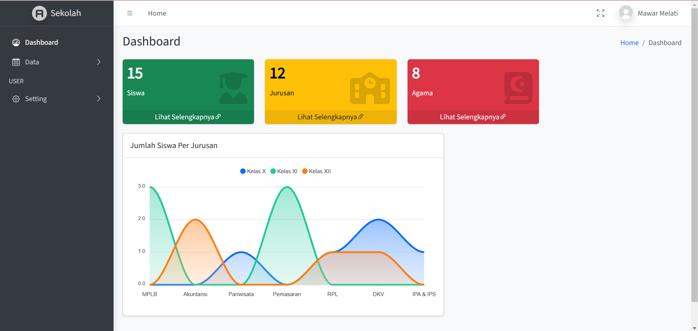

### 🛠️ Dashboard Admin
Menampilkan informasi siswa, jurusan, agama dan user dengan statistik, dapat mengakses semua data termasuk data user, dapat melakukan CRUD (Create, Read, Update, dan Delete).

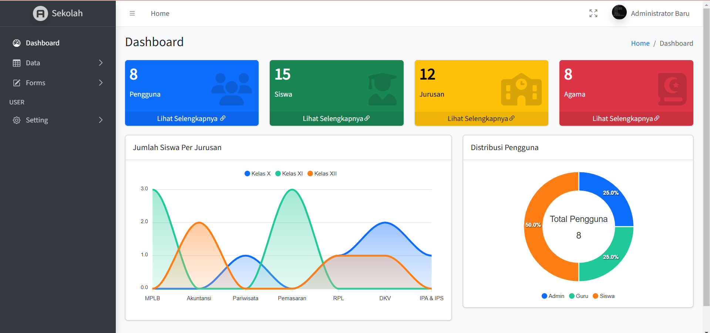

---

## 🗂️ Halaman Data

### 👥 Data Siswa
Menampilkan seluruh data siswa yang terdaftar.

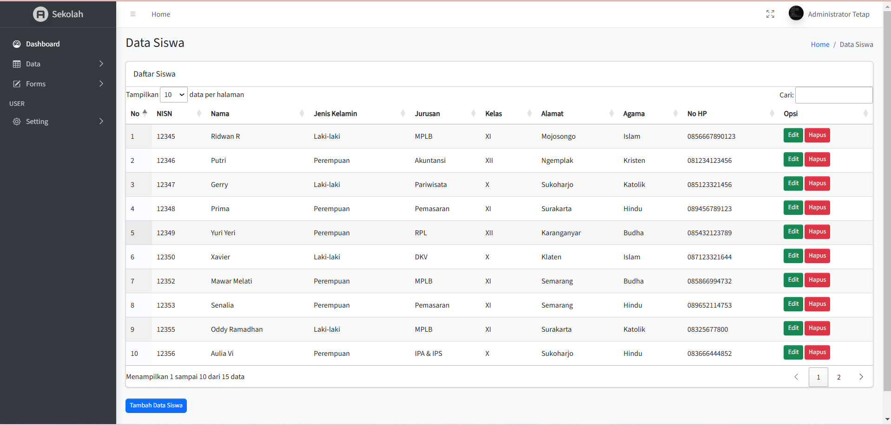

### 🏫 Data Jurusan
Mengelola jurusan yang tersedia di sekolah.

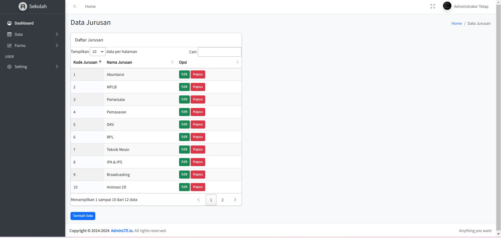

### 🙏 Data Agama
Daftar agama yang digunakan dalam data siswa.

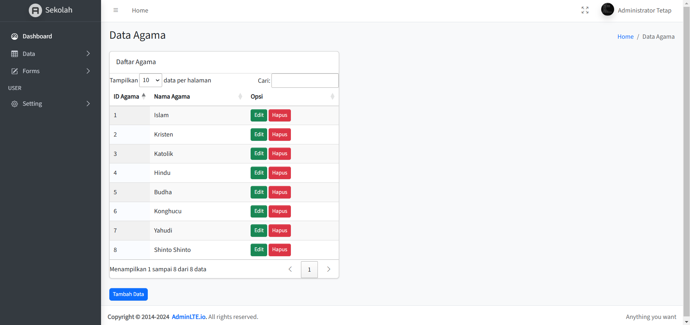

### 🔐 Data User
Daftar semua user yang bisa login ke sistem (admin, guru, siswa).

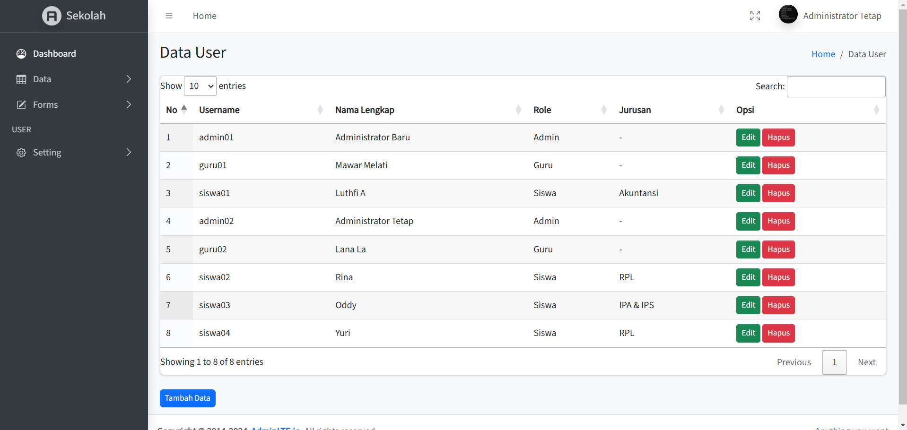

---
---

## 🔧 Hak Akses Role

> **Role Admin** memiliki akses penuh untuk input, edit, dan hapus data.  
> **Role Guru dan Siswa** hanya memiliki akses **melihat data** (read-only) untuk halaman berikut:

- Data Siswa
- Data Jurusan
- Data Agama
- Data User

---

## ➕ Tambah Data

Berikut tampilan form untuk menambahkan data (khusus untuk role **Admin**):

### ➕ Tambah Siswa

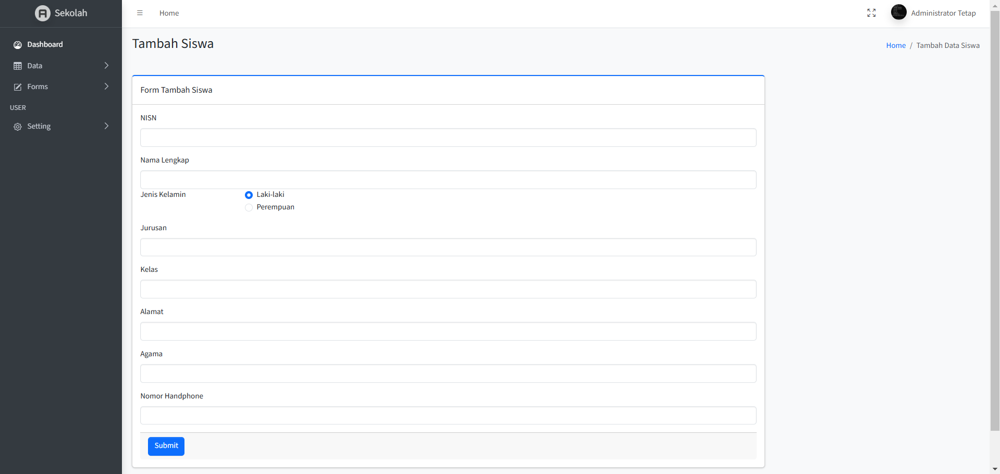

### ➕ Tambah Jurusan

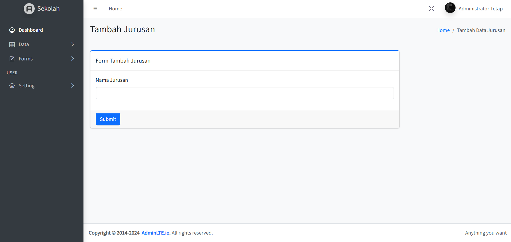

### ➕ Tambah Agama

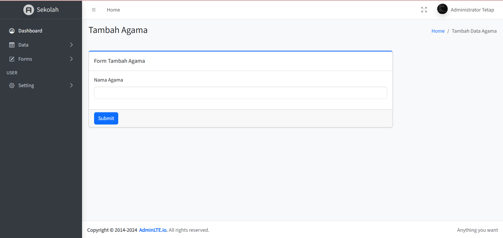

### ➕ Tambah User

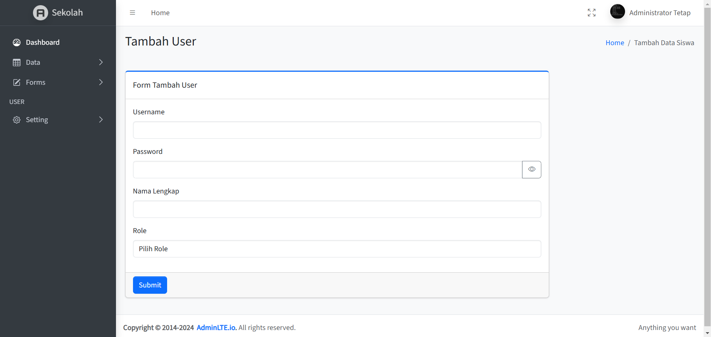

---

## ✏️ Edit Data

Role Admin dapat mengedit seluruh data berikut:

### ✏️ Edit Siswa
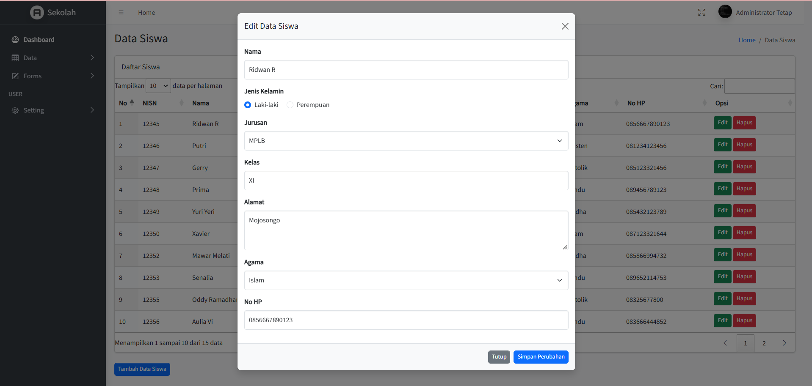

### ✏️ Edit Jurusan
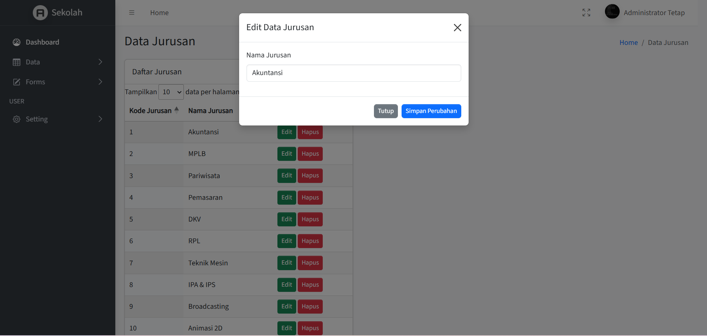

### ✏️ Edit Agama

### ✏️ Edit User
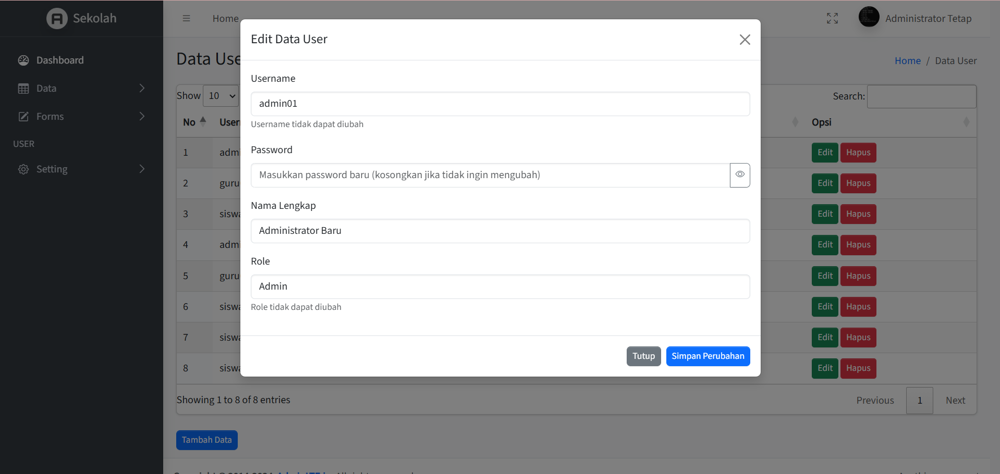

---

## 🗑️ Hapus Data

Role Admin juga dapat menghapus data jika diperlukan:

### ❌ Hapus Siswa
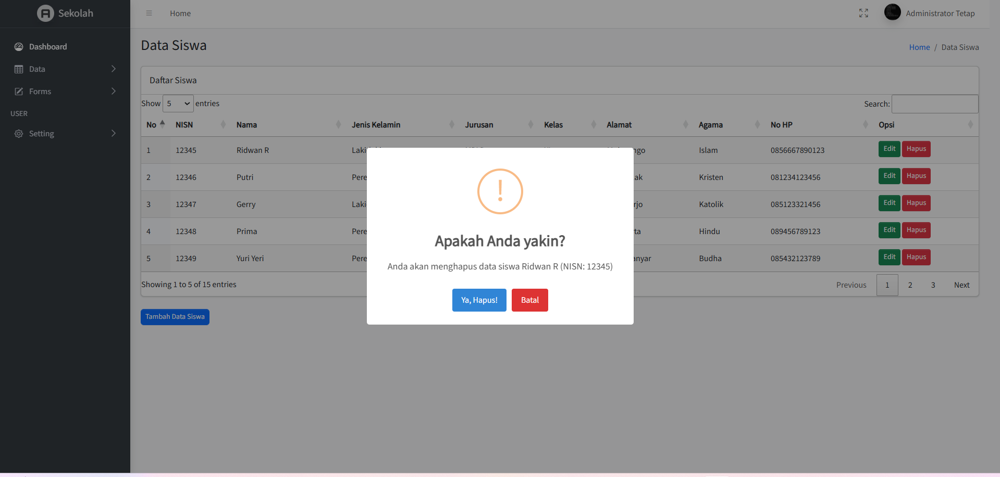

### ❌ Hapus Jurusan
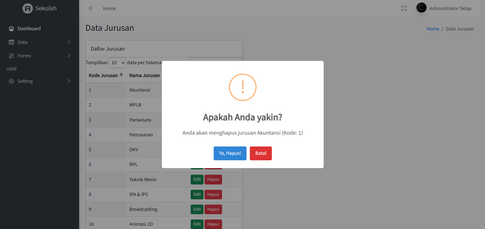

### ❌ Hapus Agama
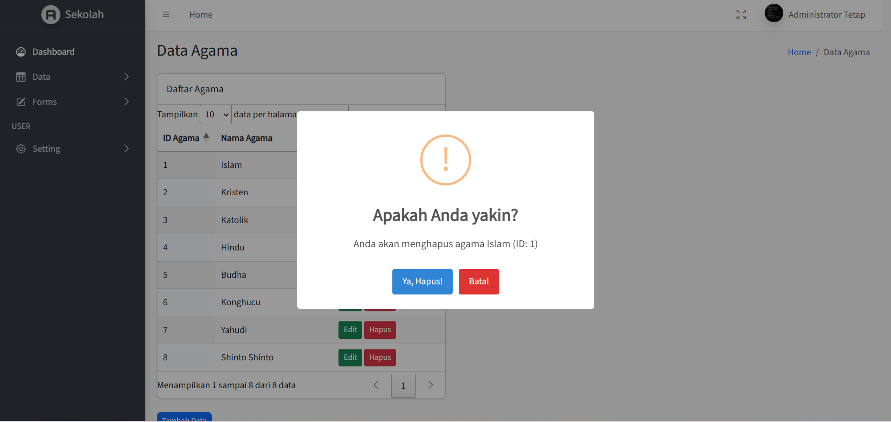

### ❌ Hapus User
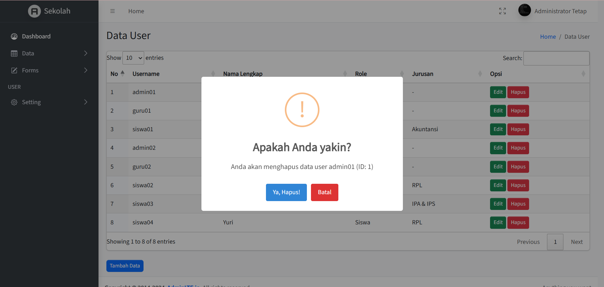

---

## 🔐 Halaman Login & Logout

### 🔑 Login Page

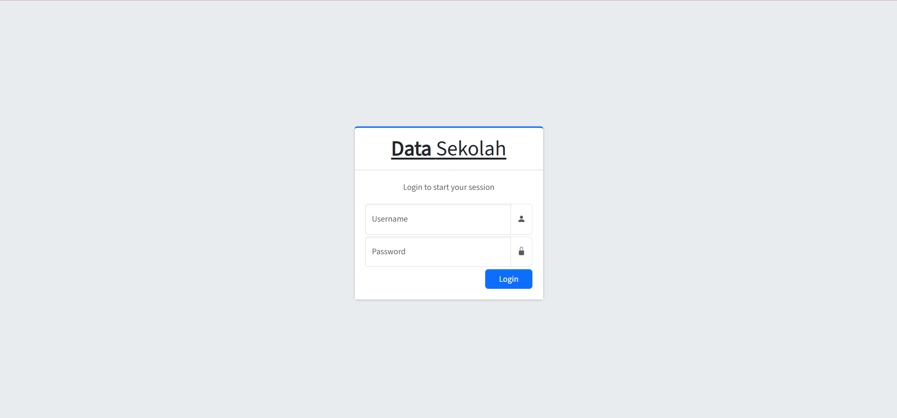

### 🚪 Validasi Logout

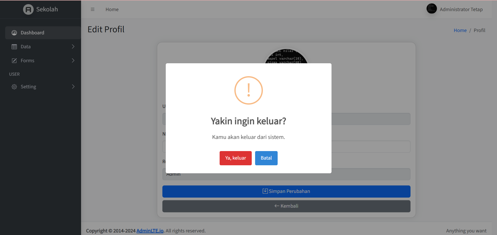

---

## 👤 Profil Pengguna

Menampilkan informasi akun pengguna yang sedang login.

---

## 🧩 Rancangan Database

Berikut adalah struktur database yang digunakan dalam aplikasi ini.

---

### 📄 Database `sekolah`

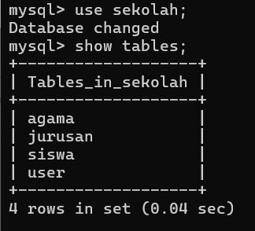

---

### 📄 Tabel `agama`

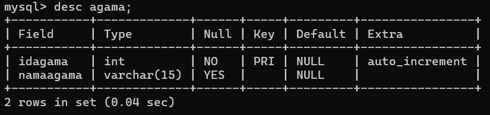

---

### 📄 Tabel `jurusan`

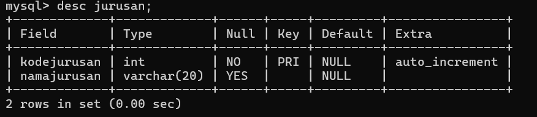

---

### 📄 Tabel `siswa`

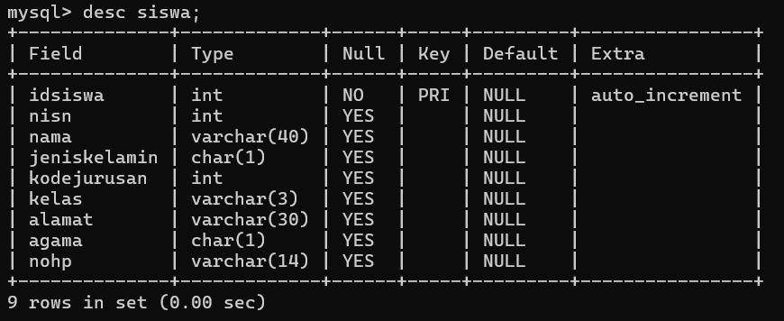

---

### 📄 Tabel `user`

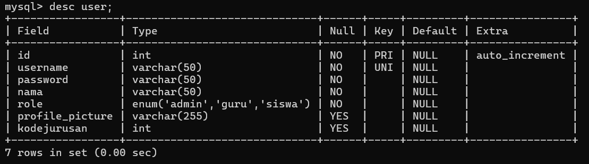
